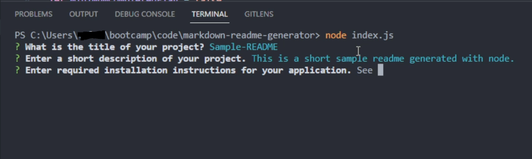

# markdown-readme-generator

## Description

This project will generate a professional README using node from user input inside of the terminal. This streamlines the process to create a README as I can run my application instead of using a template for it. 

## Table of Contents

- [Installation](#installation)
- [Usage](#usage)
- [Credits](#credits)
- [License](#license)

## Installation

To install this program, you are required to have node and npm installed locally on your machine. If that is done, follow the steps below.

- Clone the repository from [this link](https://github.com/blaubachs/markdown-readme-generator.git).
- In your terminal, make sure you are in the directory for "markdown-readme-generator".
- Next, run the command "npm install". This should install the node modules required for this application.
- While still in the same directory inside of your terminal, to run the application, enter the command "node index.js".

## Usage

To use this application, it can be ran from the terminal by using the command "node index.js". 

After starting the application, the user will be prompted with several questions to fill out as required to create a README. Responses can just be typed directly into the terminal, and it will proceed on pressing the "enter" key.

*Example of initialization of the application, and prompts that user will be shown.*

Once the prompts have completed, a README will be created in the directory "./generated-readme". Additionally, this file will be overwritten every time the application is run.

## License

No license.
